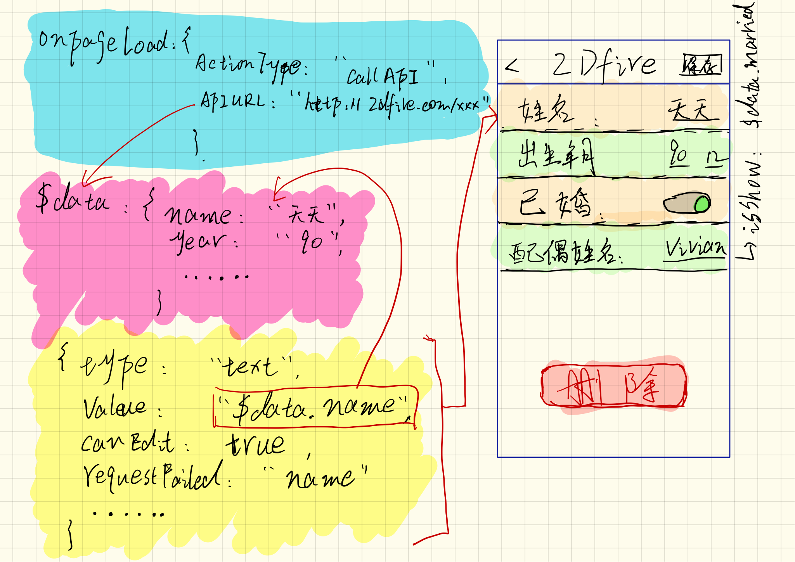

两年前刚刚开始接手火掌柜的时候，作为的面向商家的APP，有非常多的设置页面，但是每个页面的设置控件又逃不出那么几个类型。就在想是否可以通过一些配置下发给客户端，告诉客户端这些页面具体要展示哪些控件，保存要调用什么接口，和一些相关的跳转页面。那么客户就可以关注基础组件的开发，一般情况下不需要发版就可以完成新需求。

但是我们花了两年时间才能做这次分享，虽然我们现在还是有很多问题要去解决。两年中我们通过一次次整个App的架构改造才有了动态化的基础。

这些架构改造包括：

1. 逻辑后移
2. 整个app通过原来在一个控制器上通过显示、隐藏子view的方式改成了Navication controller控制的方式。
3. 整个app每个页面建立的一套路由映射机制（这样才能通过接口告诉客户需要跳转哪个页面）
4. 模块化拆分
5. 页面组件添加抽象成数据模型
6. 处理页面组件之间的联动

按照石胆的话说这都叫做”还债“ 。

然后在去年四月份，掌柜首页迎来了一次重大的改版。当时跟`大米`决定趁着这次首页改造先把首页动态化做了。随后的首页的天气、广告、功能大全都是通过这个架构实现的。

今天聊的动态化更加侧重于内部列表、设置表单页面的动态化。由于跟首页的场景区别比较大，所以我们通过两个方案提供，但是整体的思路还是一样的。

## 目标

1. 交付给产品经理使用，通过网页后台配置、调整客户端页面
2. 形成一套完善统一的交互规范
3. 客户端不发版可以完成新的需求
4. cover掉80%的需求
5. 多业态和国际化的基础方案

## 实现方式

1. 数据和布局接口分离
2. 组件和动作分离
3. 双向绑定
4. 统一端上的页面路由
5. 简单的表达式支持
6. 多级缓存变量池
7. 更新策略
8. 一套完善的开发流程

## 图

## 为什么是这个方案

1. 团队基因
2. 如果前端其实适配机型也是个问题
3. 已经有基于数据模型搭建页面的规范
4. 已经有了一个比较成熟的路由层
5. 首页动态化看起来不错
6. 体验上还是有一点点优势

## TODO

1. 列表`for`语句支持
2. 后台用户体系
3. 后台开发流程完善
4. 根据交互规范完善组件库

## keynote

[火掌柜动态化方案](https://dmanager.github.io/HKReporter-keynote/#/overview)